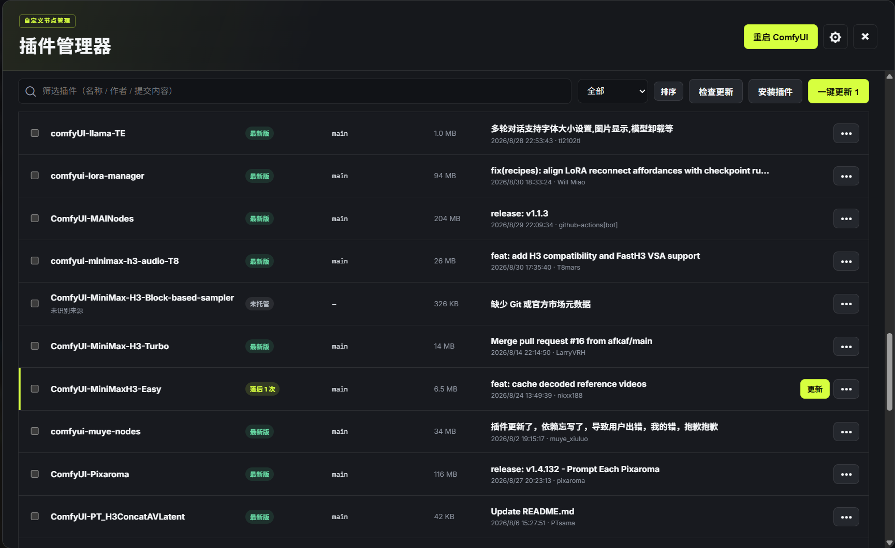
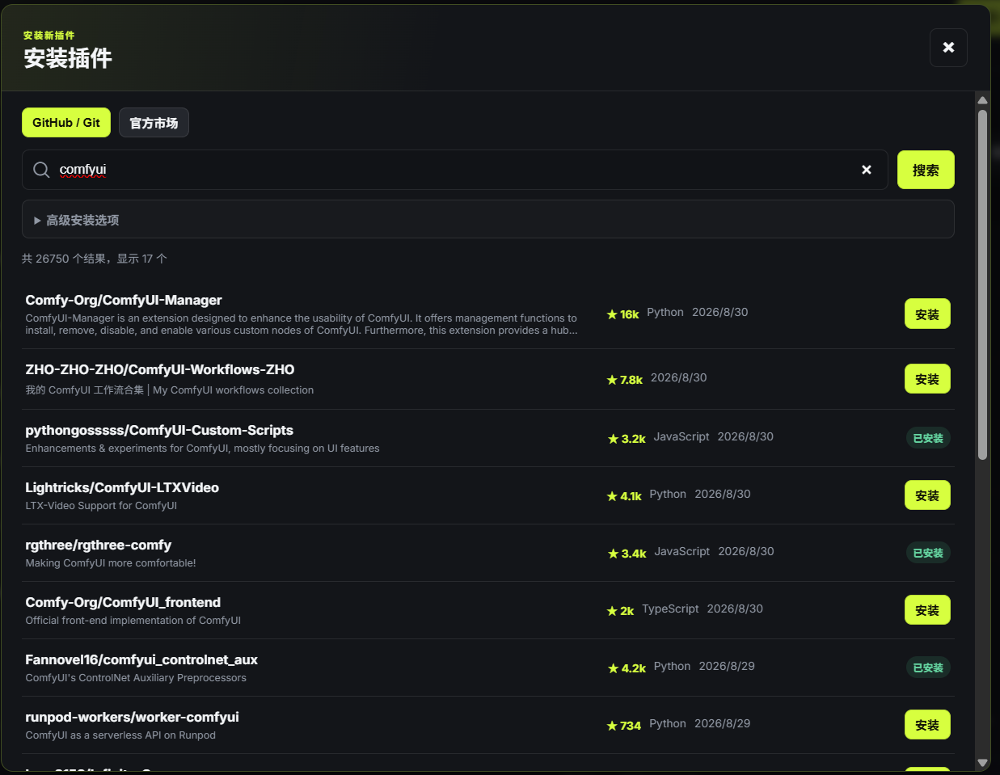
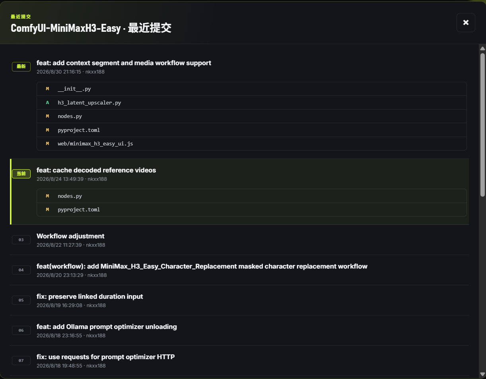

# ComfyUI Custom Node Manager

English | [简体中文](./README.md)

A ComfyUI custom node manager built around GitHub and Git repositories, available directly from the ComfyUI top bar.

## Why This Project

I built this plugin because ComfyUI's built-in ComfyUI Manager is not always convenient for managing custom nodes:

1. It uses Comfy Registry rather than GitHub as its primary remote source, so many plugins cannot be found, and available entries may not point to the latest version.
2. Reviewing recent remote commits and changed files is inconvenient, as is checking exactly what has changed locally.
3. There is no quick way to open a plugin's local directory or its GitHub repository.
4. Viewing and updating plugins often requires switching to a third-party launcher instead of managing everything within ComfyUI.

This project therefore treats Git repositories as the primary source while retaining support for searching and installing packages from Comfy Registry.

## Key Features

- Immediately displays installed plugins, branches, status, and latest commits without waiting for a network check.
- Checks remote updates on demand and refreshes each result as it becomes available.
- Shows recent commits, pending updates, and the files changed by each commit.
- Shows local changes and per-file diffs while ignoring cache files such as `__pycache__`.
- Updates one, selected, or all plugins with persistent progress at the bottom of the panel.
- Creates a backup before updating and rolls back automatically on failure; local changes are never overwritten without confirmation.
- Opens remote repositories by clicking plugin names and opens local plugin directories with one action.
- Searches and installs plugins from GitHub, any Git URL, or Comfy Registry.
- Supports disabling, enabling, reinstalling, and uninstalling plugins, as well as restarting ComfyUI directly.
- Adapts to ComfyUI's light/dark theme, and offers a Chinese/English UI toggle in the panel header.
- Flags cross-plugin Python dependency conflicts (incompatible version ranges, or a mismatch with what's actually installed) from the manager center's "Dependency Conflicts" tab.

## Interface Preview

### Main Interface



### Plugin Installation



### Recent Commits



## Installation

Run the following command inside ComfyUI's `custom_nodes` directory:

```bash
git clone https://github.com/nmvjhd/comfyui-custom-node-manager.git
```

Restart ComfyUI. A **Plugin Manager** button will appear in the top bar.

To update the manager:

```bash
cd comfyui-custom-node-manager
git pull
```

## Usage

1. Open **Plugin Manager** from the top bar.
2. Select **Check for Updates** to retrieve remote status.
3. Select a status or the latest commit to review the changes.
4. Use an individual **Update** button or **Update All**. Additional actions are available from the `•••` menu.

## Support the Project

If this plugin is useful to you, you can support its development by buying me a coffee.

<a href="./assets/wechat-pay.jpg">
  
</a>

## Notes

- Restart ComfyUI after installing, updating, disabling, enabling, or uninstalling plugins for the changes to take full effect.
- Force sync discards local changes and removes untracked files. Use it with care.
- Avoid managing the same plugin with multiple managers at the same time, as this may cause directory conflicts.
